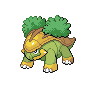

=== "Trainer Encounters"

	
	???+ note "Leader Gardenia"
		

		

		  

		    
		    

		      <a href="/route-testing/pokemon/182-bellossom">Bellossom</a>
		      Lv 25
		    

		  

		  

		    

		      
		      

		    

		    

		      
Ability:

		      Chlorophyll
		    

		    

		      
Nature:

		      Relaxed
		    

		    

		      
Held Item:

		      

		        
		        Wide Lens
		      

		    

		  

		  

		    
Grass Knot

		    
Teeter Dance

		    
Dazzling Gleam

		    
Stun Spore

		  

		
		

		  

		    
		    

		      <a href="/route-testing/pokemon/114-tangela">Tangela</a>
		      Lv 25
		    

		  

		  

		    

		      
		      

		    

		    

		      
Ability:

		      Chlorophyll
		    

		    

		      
Nature:

		      Rash
		    

		    

		      
Held Item:

		      

		        
		        Coba Berry
		      

		    

		  

		  

		    
Grass Knot

		    
Shock Wave

		    
Ancient Power

		    
Stun Spore

		  

		
		

		  

		    
		    

		      <a href="/route-testing/pokemon/421-cherrim">Cherrim</a>
		      Lv 25
		    

		  

		  

		    

		      
		      

		    

		    

		      
Ability:

		      Flower Gift
		    

		    

		      
Nature:

		      Hasty
		    

		    

		      
Held Item:

		      

		        
		        Focus Sash
		      

		    

		  

		  

		    
Grass Knot

		    
Sunny Day

		    
Weather Ball

		    
Morning Sun

		  

		
		

		  

		    
		    

		      <a href="/route-testing/pokemon/388-grotle">Grotle</a>
		      Lv 25
		    

		  

		  

		    

		      
		      

		    

		    

		      
Ability:

		      Overgrow
		    

		    

		      
Nature:

		      Adamant
		    

		    

		      
Held Item:

		      

		        
		        Leftovers
		      

		    

		  

		  

		    
Seed Bomb

		    
Protect

		    
Leech Seed

		    
Bulldoze

		  

		
		

		  

		    
		    

		      <a href="/route-testing/pokemon/286-breloom">Breloom</a>
		      Lv 25
		    

		  

		  

		    

		      
		      
		    

		    

		      
Ability:

		      Technician
		    

		    

		      
Nature:

		      Naughty
		    

		    

		      
Held Item:

		      

		        
		        Muscle Band
		      

		    

		  

		  

		    
Bullet Seed

		    
Mach Punch

		    
Thunder Punch

		    
Spore

		  

		
		

		  

		    
		    

		      <a href="/route-testing/pokemon/407-roserade">Roserade</a>
		      Lv 26
		    

		  

		  

		    

		      
		      
		    

		    

		      
Ability:

		      Technician
		    

		    

		      
Nature:

		      Timid
		    

		    

		      
Held Item:

		      

		        
		        Sitrus Berry
		      

		    

		  

		  

		    
Magical Leaf

		    
Sludge

		    
Dazzling Gleam

		    
Extrasensory

		  

		

