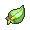
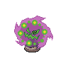
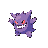
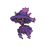
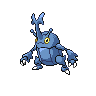
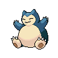
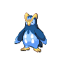
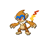

=== "Trainer Encounters"

	
	???+ note "Leader Fantina"
		

		

		  

		    
		    

		      <a href="/route-testing/pokemon/426-drifblim">Drifblim</a>
		      Lv 32
		    

		  

		  

		    

		      
		      
		    

		    

		      
Ability:

		      Unburden
		    

		    

		      
Nature:

		      Naive
		    

		    

		      
Held Item:

		      

		        
		        Starf Berry
		      

		    

		  

		  

		    
Shadow Ball

		    
Air Slash

		    
Baton Pass

		    
Calm Mind

		  

		
		

		  

		    
		    

		      <a href="/route-testing/pokemon/356-dusclops">Dusclops</a>
		      Lv 32
		    

		  

		  

		    

		      
		      

		    

		    

		      
Ability:

		      Pressure
		    

		    

		      
Nature:

		      Impish
		    

		    

		      
Held Item:

		      

		        
		        Leftovers
		      

		    

		  

		  

		    
Shadow Punch

		    
Will O Wisp

		    
Protect

		    
Pain Split

		  

		
		

		  

		    
		    

		      <a href="/route-testing/pokemon/354-banette">Banette</a>
		      Lv 32
		    

		  

		  

		    

		      
		      

		    

		    

		      
Ability:

		      Insomnia
		    

		    

		      
Nature:

		      Adamant
		    

		    

		      
Held Item:

		      

		        
		        Muscle Band
		      

		    

		  

		  

		    
Shadow Claw

		    
Will O Wisp

		    
Sucker Punch

		    
Disable

		  

		
		

		  

		    
		    

		      <a href="/route-testing/pokemon/442-spiritomb">Spiritomb</a>
		      Lv 32
		    

		  

		  

		    

		      
		      
		    

		    

		      
Ability:

		      Pressure
		    

		    

		      
Nature:

		      Relaxed
		    

		    

		      
Held Item:

		      

		        
		        Zoom Lens
		      

		    

		  

		  

		    
Shadow Ball

		    
Will O Wisp

		    
Dark Pulse

		    
Disable

		  

		
		

		  

		    
		    

		      <a href="/route-testing/pokemon/094-gengar">Gengar</a>
		      Lv 32
		    

		  

		  

		    

		      
		      
		    

		    

		      
Ability:

		      Levitate
		    

		    

		      
Nature:

		      Naive
		    

		    

		      
Held Item:

		      

		        
		        Wise Glasses
		      

		    

		  

		  

		    
Shadow Ball

		    
Will O Wisp

		    
Sludge Bomb

		    
Dazzling Gleam

		  

		
		

		  

		    
		    

		      <a href="/route-testing/pokemon/429-mismagius">Mismagius</a>
		      Lv 33
		    

		  

		  

		    

		      
		      

		    

		    

		      
Ability:

		      Levitate
		    

		    

		      
Nature:

		      Naive
		    

		    

		      
Held Item:

		      

		        
		        Sitrus Berry
		      

		    

		  

		  

		    
Shadow Ball

		    
Power Gem

		    
Calm Mind

		    
Dazzling Gleam

		  

		

	
	???+ note "Rival Barry"
		

		=== "Fire"
			

				

				  

				    
				    

				      <a href="/route-testing/pokemon/397-staravia">Staravia</a>
				      Lv 32
				    

				  

				  

				    

				      
				      
				    

				    

				      
Ability:

				      Reckless
				    

				    

				      
Nature:

				      -
				    

				    

				      
Held Item:

				      

				        
				        Muscle Band
				      

				    

				  

				  

				    
Facade

				    
Aerial Ace

				    
Double Team

				    
Endeavor

				  

				
				

				  

				    
				    

				      <a href="/route-testing/pokemon/214-heracross">Heracross</a>
				      Lv 32
				    

				  

				  

				    

				      
				      
				    

				    

				      
Ability:

				      Guts
				    

				    

				      
Nature:

				      -
				    

				    

				      
Held Item:

				      

				        
				        Coba Berry
				      

				    

				  

				  

				    
Bug Bite

				    
Brick Break

				    
Aerial Ace

				    
Knock Off

				  

				
				

				  

				    
				    

				      <a href="/route-testing/pokemon/143-snorlax">Snorlax</a>
				      Lv 32
				    

				  

				  

				    

				      
				      

				    

				    

				      
Ability:

				      Thick Fat
				    

				    

				      
Nature:

				      -
				    

				    

				      
Held Item:

				      

				        
				        Leftovers
				      

				    

				  

				  

				    
Body Slam

				    
Yawn

				    
Amnesia

				    
Rock Slide

				  

				
				

				  

				    
				    

				      <a href="/route-testing/pokemon/394-prinplup">Prinplup</a>
				      Lv 33
				    

				  

				  

				    

				      
				      

				    

				    

				      
Ability:

				      Torrent
				    

				    

				      
Nature:

				      -
				    

				    

				      
Held Item:

				      

				        
				        Sitrus Berry
				      

				    

				  

				  

				    
Scald

				    
Icy Wind

				    
Grass Knot

				    
Aerial Ace

				  

				

		=== "Water"
			

				

				  

				    
				    

				      <a href="/route-testing/pokemon/397-staravia">Staravia</a>
				      Lv 32
				    

				  

				  

				    

				      
				      
				    

				    

				      
Ability:

				      Reckless
				    

				    

				      
Nature:

				      -
				    

				    

				      
Held Item:

				      

				        
				        Muscle Band
				      

				    

				  

				  

				    
Facade

				    
Aerial Ace

				    
Double Team

				    
Endeavor

				  

				
				

				  

				    
				    

				      <a href="/route-testing/pokemon/214-heracross">Heracross</a>
				      Lv 32
				    

				  

				  

				    

				      
				      
				    

				    

				      
Ability:

				      Guts
				    

				    

				      
Nature:

				      -
				    

				    

				      
Held Item:

				      

				        
				        Coba Berry
				      

				    

				  

				  

				    
Bug Bite

				    
Brick Break

				    
Aerial Ace

				    
Knock Off

				  

				
				

				  

				    
				    

				      <a href="/route-testing/pokemon/143-snorlax">Snorlax</a>
				      Lv 32
				    

				  

				  

				    

				      
				      

				    

				    

				      
Ability:

				      Thick Fat
				    

				    

				      
Nature:

				      -
				    

				    

				      
Held Item:

				      

				        
				        Leftovers
				      

				    

				  

				  

				    
Body Slam

				    
Yawn

				    
Amnesia

				    
Rock Slide

				  

				
				

				  

				    
				    

				      <a href="/route-testing/pokemon/388-grotle">Grotle</a>
				      Lv 33
				    

				  

				  

				    

				      
				      

				    

				    

				      
Ability:

				      Overgrow
				    

				    

				      
Nature:

				      -
				    

				    

				      
Held Item:

				      

				        
				        Sitrus Berry
				      

				    

				  

				  

				    
Seed Bomb

				    
Crunch

				    
Leech Seed

				    
Protect

				  

				

		=== "Grass"
			

				

				  

				    
				    

				      <a href="/route-testing/pokemon/397-staravia">Staravia</a>
				      Lv 32
				    

				  

				  

				    

				      
				      
				    

				    

				      
Ability:

				      Reckless
				    

				    

				      
Nature:

				      -
				    

				    

				      
Held Item:

				      

				        
				        Muscle Band
				      

				    

				  

				  

				    
Facade

				    
Aerial Ace

				    
Double Team

				    
Endeavor

				  

				
				

				  

				    
				    

				      <a href="/route-testing/pokemon/214-heracross">Heracross</a>
				      Lv 32
				    

				  

				  

				    

				      
				      
				    

				    

				      
Ability:

				      Guts
				    

				    

				      
Nature:

				      -
				    

				    

				      
Held Item:

				      

				        
				        Coba Berry
				      

				    

				  

				  

				    
Bug Bite

				    
Brick Break

				    
Aerial Ace

				    
Knock Off

				  

				
				

				  

				    
				    

				      <a href="/route-testing/pokemon/143-snorlax">Snorlax</a>
				      Lv 32
				    

				  

				  

				    

				      
				      

				    

				    

				      
Ability:

				      Thick Fat
				    

				    

				      
Nature:

				      -
				    

				    

				      
Held Item:

				      

				        
				        Leftovers
				      

				    

				  

				  

				    
Body Slam

				    
Yawn

				    
Amnesia

				    
Rock Slide

				  

				
				

				  

				    
				    

				      <a href="/route-testing/pokemon/391-monferno">Monferno</a>
				      Lv 33
				    

				  

				  

				    

				      
				      
				    

				    

				      
Ability:

				      Iron Fist
				    

				    

				      
Nature:

				      -
				    

				    

				      
Held Item:

				      

				        
				        Sitrus Berry
				      

				    

				  

				  

				    
Flamethrower

				    
Low Kick

				    
Grass Knot

				    
Fake Out

				  

				

