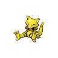
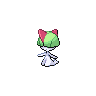
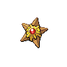

=== "Trainer Encounters"

	
	???+ note "Schoolkid Harrison"
		

		

		  

		    
		    

		      <a href="/route-testing/pokemon/063-abra">Abra</a>
		      Lv 8
		    

		  

		  

		    

		      
		      

		    

		    

		      
Ability:

		      -
		    

		    

		      
Nature:

		      -
		    

		    

		      
Held Item:

		      

		        

		        -
		      

		    

		  

		  

		    
-

		    
-

		    
-

		    
-

		  

		
		

		  

		    
		    

		      <a href="/route-testing/pokemon/054-psyduck">Psyduck</a>
		      Lv 8
		    

		  

		  

		    

		      
		      

		    

		    

		      
Ability:

		      -
		    

		    

		      
Nature:

		      -
		    

		    

		      
Held Item:

		      

		        

		        -
		      

		    

		  

		  

		    
-

		    
-

		    
-

		    
-

		  

		

	
	???+ note "Schoolkid Christine"
		

		

		  

		    
		    

		      <a href="/route-testing/pokemon/280-ralts">Ralts</a>
		      Lv 8
		    

		  

		  

		    

		      
		      
		    

		    

		      
Ability:

		      -
		    

		    

		      
Nature:

		      -
		    

		    

		      
Held Item:

		      

		        

		        -
		      

		    

		  

		  

		    
-

		    
-

		    
-

		    
-

		  

		
		

		  

		    
		    

		      <a href="/route-testing/pokemon/120-staryu">Staryu</a>
		      Lv 8
		    

		  

		  

		    

		      
		      

		    

		    

		      
Ability:

		      -
		    

		    

		      
Nature:

		      -
		    

		    

		      
Held Item:

		      

		        

		        -
		      

		    

		  

		  

		    
-

		    
-

		    
-

		    
-

		  

		

