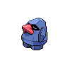
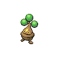
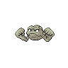
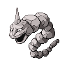
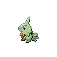
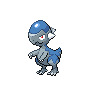

=== "Trainer Encounters"

	
	???+ note "Leader Roark"
		

		

		  

		    
		    

		      <a href="/route-testing/pokemon/299-nosepass">Nosepass</a>
		      Lv 15
		    

		  

		  

		    

		      
		      

		    

		    

		      
Ability:

		      Sturdy
		    

		    

		      
Nature:

		      Modest
		    

		    

		      
Held Item:

		      

		        
		        Smooth Rock
		      

		    

		  

		  

		    
Stealth Rock

		    
Sandstorm

		    
Thunder Wave

		    
Shock Wave

		  

		
		

		  

		    
		    

		      <a href="/route-testing/pokemon/438-bonsly">Bonsly</a>
		      Lv 15
		    

		  

		  

		    

		      
		      

		    

		    

		      
Ability:

		      Rock Head
		    

		    

		      
Nature:

		      Impish
		    

		    

		      
Held Item:

		      

		        
		        Rindo Berry
		      

		    

		  

		  

		    
Stealth Rock

		    
Brick Break

		    
Rollout

		    
Defense Curl

		  

		
		

		  

		    
		    

		      <a href="/route-testing/pokemon/074-geodude">Geodude</a>
		      Lv 15
		    

		  

		  

		    

		      
		      
		    

		    

		      
Ability:

		      Rock Head
		    

		    

		      
Nature:

		      Adamant
		    

		    

		      
Held Item:

		      

		        
		        Expert Belt
		      

		    

		  

		  

		    
Bulldoze

		    
Rock Tomb

		    
Fire Punch

		    
Thunder Punch

		  

		
		

		  

		    
		    

		      <a href="/route-testing/pokemon/095-onix">Onix</a>
		      Lv 15
		    

		  

		  

		    

		      
		      
		    

		    

		      
Ability:

		      Rock Head
		    

		    

		      
Nature:

		      Jolly
		    

		    

		      
Held Item:

		      

		        
		        Muscle Band
		      

		    

		  

		  

		    
Stealth Rock

		    
Rock Tomb

		    
Bulldoze

		    
Sandstorm

		  

		
		

		  

		    
		    

		      <a href="/route-testing/pokemon/246-larvitar">Larvitar</a>
		      Lv 15
		    

		  

		  

		    

		      
		      
		    

		    

		      
Ability:

		      Guts
		    

		    

		      
Nature:

		      Jolly
		    

		    

		      
Held Item:

		      

		        
		        Flame Orb
		      

		    

		  

		  

		    
Rock Tomb

		    
Bulldoze

		    
Bite

		    
Protect

		  

		
		

		  

		    
		    

		      <a href="/route-testing/pokemon/408-cranidos">Cranidos</a>
		      Lv 16
		    

		  

		  

		    

		      
		      

		    

		    

		      
Ability:

		      Rock Head
		    

		    

		      
Nature:

		      Hasty
		    

		    

		      
Held Item:

		      

		        
		        Sitrus Berry
		      

		    

		  

		  

		    
Zen Headbutt

		    
Rock Tomb

		    
Thunder Punch

		    
Scary Face

		  

		

