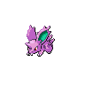
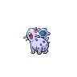

=== "Wild Encounters"

	???+ note "Morning Lv. 4 - 5"
		

                     [Bidoof](/platinum-renegade/pokemon/399-bidoof) 30%
                

                     [Starly](/platinum-renegade/pokemon/396-starly) 30%
                

                     [Nidoran M](/platinum-renegade/pokemon/032-nidoran-m) 10%
                

                     [Kricketot](/platinum-renegade/pokemon/401-kricketot) 10%
                

                     [Pidgey](/platinum-renegade/pokemon/016-pidgey) 10%
                

                     [Nidoran F](/platinum-renegade/pokemon/029-nidoran-f) 10%
                

	???+ note "Day Lv. 4 - 5"
		

                     [Starly](/platinum-renegade/pokemon/396-starly) 30%
                

                     [Bidoof](/platinum-renegade/pokemon/399-bidoof) 30%
                

                     [Pidgey](/platinum-renegade/pokemon/016-pidgey) 20%
                

                     [Nidoran M](/platinum-renegade/pokemon/032-nidoran-m) 10%
                

                     [Nidoran F](/platinum-renegade/pokemon/029-nidoran-f) 10%
                

	???+ note "Night Lv. 4 - 5"
		

                     [Bidoof](/platinum-renegade/pokemon/399-bidoof) 30%
                

                     [Starly](/platinum-renegade/pokemon/396-starly) 30%
                

                     [Nidoran M](/platinum-renegade/pokemon/032-nidoran-m) 10%
                

                     [Kricketot](/platinum-renegade/pokemon/401-kricketot) 10%
                

                     [Hoothoot](/platinum-renegade/pokemon/163-hoothoot) 10%
                

                     [Nidoran F](/platinum-renegade/pokemon/029-nidoran-f) 10%
                

=== "Trainer Encounters"

	
	???+ note "Rival Barry"
		

		=== "Fire"
			

				

				  

				    
				    

				      <a href="/route-testing/pokemon/393-piplup">Piplup</a>
				      Lv 5
				    

				  

				  

				    

				      
				      

				    

				    

				      
Ability:

				      -
				    

				    

				      
Nature:

				      -
				    

				    

				      
Held Item:

				      

				        

				        -
				      

				    

				  

				  

				    
-

				    
-

				    
-

				    
-

				  

				

		=== "Water"
			

				

				  

				    
				    

				      <a href="/route-testing/pokemon/387-turtwig">Turtwig</a>
				      Lv 5
				    

				  

				  

				    

				      
				      

				    

				    

				      
Ability:

				      -
				    

				    

				      
Nature:

				      -
				    

				    

				      
Held Item:

				      

				        

				        -
				      

				    

				  

				  

				    
-

				    
-

				    
-

				    
-

				  

				

		=== "Grass"
			

				

				  

				    
				    

				      <a href="/route-testing/pokemon/390-chimchar">Chimchar</a>
				      Lv 5
				    

				  

				  

				    

				      
				      

				    

				    

				      
Ability:

				      -
				    

				    

				      
Nature:

				      -
				    

				    

				      
Held Item:

				      

				        

				        -
				      

				    

				  

				  

				    
-

				    
-

				    
-

				    
-

				  

				

