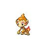
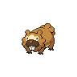
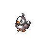

=== "Trainer Encounters"

	
	???+ note "Rival Lucas"
		

		=== "Fire"
			

				

				  

				    
				    

				      <a href="/route-testing/pokemon/387-turtwig">Turtwig</a>
				      Lv 9
				    

				  

				  

				    

				      
				      

				    

				    

				      
Ability:

				      -
				    

				    

				      
Nature:

				      -
				    

				    

				      
Held Item:

				      

				        

				        -
				      

				    

				  

				  

				    
-

				    
-

				    
-

				    
-

				  

				

		=== "Water"
			

				

				  

				    
				    

				      <a href="/route-testing/pokemon/390-chimchar">Chimchar</a>
				      Lv 9
				    

				  

				  

				    

				      
				      

				    

				    

				      
Ability:

				      -
				    

				    

				      
Nature:

				      -
				    

				    

				      
Held Item:

				      

				        

				        -
				      

				    

				  

				  

				    
-

				    
-

				    
-

				    
-

				  

				

		=== "Grass"
			

				

				  

				    
				    

				      <a href="/route-testing/pokemon/393-piplup">Piplup</a>
				      Lv 9
				    

				  

				  

				    

				      
				      

				    

				    

				      
Ability:

				      -
				    

				    

				      
Nature:

				      -
				    

				    

				      
Held Item:

				      

				        

				        -
				      

				    

				  

				  

				    
-

				    
-

				    
-

				    
-

				  

				

	
	???+ note "Lass Natalie"
		

		

		  

		    
		    

		      <a href="/route-testing/pokemon/161-sentret">Sentret</a>
		      Lv 7
		    

		  

		  

		    

		      
		      

		    

		    

		      
Ability:

		      -
		    

		    

		      
Nature:

		      -
		    

		    

		      
Held Item:

		      

		        

		        -
		      

		    

		  

		  

		    
-

		    
-

		    
-

		    
-

		  

		
		

		  

		    
		    

		      <a href="/route-testing/pokemon/399-bidoof">Bidoof</a>
		      Lv 7
		    

		  

		  

		    

		      
		      

		    

		    

		      
Ability:

		      -
		    

		    

		      
Nature:

		      -
		    

		    

		      
Held Item:

		      

		        

		        -
		      

		    

		  

		  

		    
-

		    
-

		    
-

		    
-

		  

		

	
	???+ note "Youngster Tristan"
		

		

		  

		    
		    

		      <a href="/route-testing/pokemon/163-hoothoot">Hoothoot</a>
		      Lv 7
		    

		  

		  

		    

		      
		      
		    

		    

		      
Ability:

		      -
		    

		    

		      
Nature:

		      -
		    

		    

		      
Held Item:

		      

		        

		        -
		      

		    

		  

		  

		    
-

		    
-

		    
-

		    
-

		  

		
		

		  

		    
		    

		      <a href="/route-testing/pokemon/396-starly">Starly</a>
		      Lv 7
		    

		  

		  

		    

		      
		      
		    

		    

		      
Ability:

		      -
		    

		    

		      
Nature:

		      -
		    

		    

		      
Held Item:

		      

		        

		        -
		      

		    

		  

		  

		    
-

		    
-

		    
-

		    
-

		  

		

	
	???+ note "Youngster Logan"
		

		

		  

		    
		    

		      <a href="/route-testing/pokemon/058-growlithe">Growlithe</a>
		      Lv 7
		    

		  

		  

		    

		      
		      

		    

		    

		      
Ability:

		      -
		    

		    

		      
Nature:

		      -
		    

		    

		      
Held Item:

		      

		        

		        -
		      

		    

		  

		  

		    
-

		    
-

		    
-

		    
-

		  

		
		

		  

		    
		    

		      <a href="/route-testing/pokemon/412-burmy">Burmy</a>
		      Lv 7
		    

		  

		  

		    

		      
		      

		    

		    

		      
Ability:

		      -
		    

		    

		      
Nature:

		      -
		    

		    

		      
Held Item:

		      

		        

		        -
		      

		    

		  

		  

		    
-

		    
-

		    
-

		    
-

		  

		
		

		  

		    
		    

		      <a href="/route-testing/pokemon/263-zigzagoon">Zigzagoon</a>
		      Lv 7
		    

		  

		  

		    

		      
		      

		    

		    

		      
Ability:

		      -
		    

		    

		      
Nature:

		      -
		    

		    

		      
Held Item:

		      

		        

		        -
		      

		    

		  

		  

		    
-

		    
-

		    
-

		    
-

		  

		

